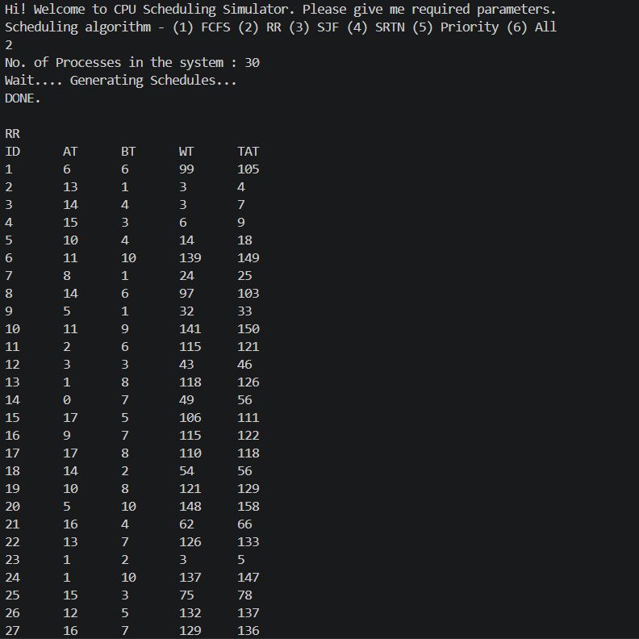

# CPU Scheduling Simulator

A C program that simulates five CPU scheduling algorithms on randomly generated processes.

---

## Algorithms

**FCFS (First Come First Serve)**
Processes are executed in the order they arrive. Non-preemptive. Simple but can cause long waiting times (convoy effect).

**RR (Round Robin)**
Each process gets a fixed time quantum (q=4). Preemptive. Fair for all processes; good for time-sharing systems.

**SJF (Shortest Job First)**
Among available processes, the one with the shortest burst time runs next. Non-preemptive. Minimizes average waiting time.

**SRTN (Shortest Remaining Time Next)**
Preemptive version of SJF. At every tick, the process with the least remaining time is chosen. Optimal average waiting time.

**Priority Scheduling**
Each process has a priority; lower number = higher priority. Non-preemptive. Can cause starvation of low-priority processes.

---

## How to Run

```bash
gcc -o scheduler scheduler.c
./scheduler
```

Follow the prompts — select an algorithm (1–6), then enter the number of processes. Process attributes (AT, BT, Priority) are randomly generated.

---

## Sample Output

### Output 1


### Output 2
(output2.png)
